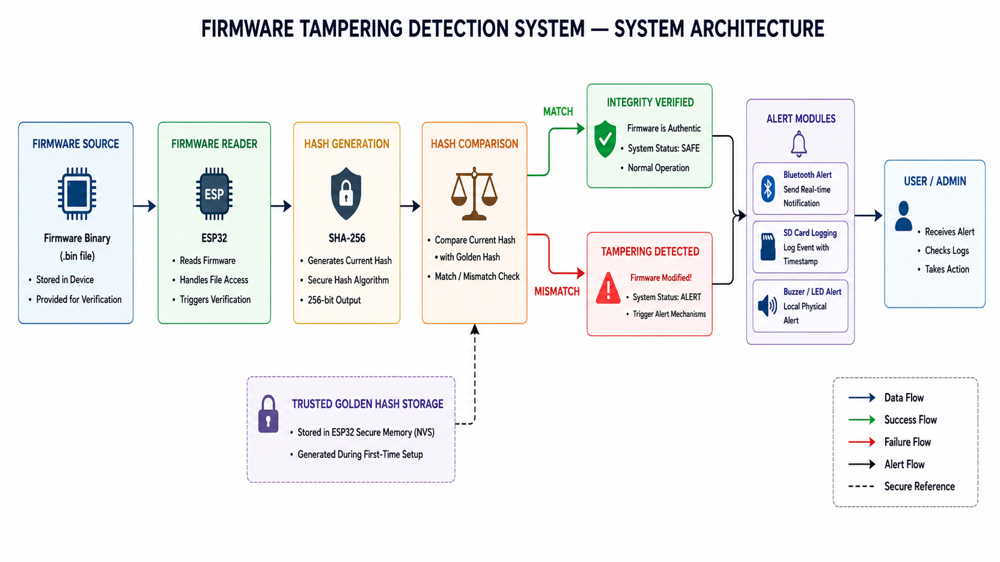
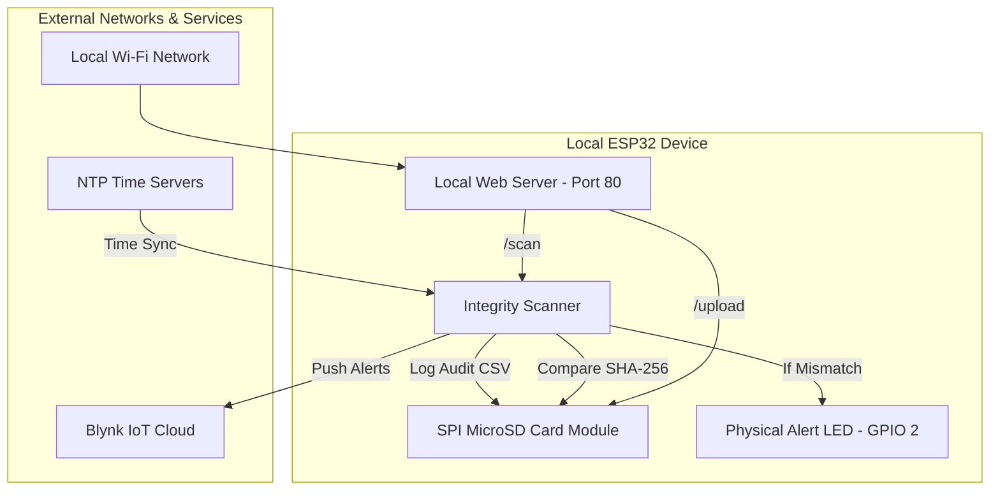

# 🔐 IoT Firmware Tampering Detection System (ESP32)

An advanced embedded security system designed to monitor, log, and verify the integrity of device firmware files using hardware-accelerated **SHA-256 cryptography**, **golden-hash database comparison**, **SD-card auditing**, and **Blynk IoT cloud alerts**.

The system hosts a premium real-time web dashboard directly on the ESP32 to manage firmware provisions, execute scans, view active registries, and download comprehensive compliance CSV reports.

---

## 🚀 Key Features

* **Hardware-Accelerated Cryptography**: Uses ESP32's built-in `mbedtls` engine to calculate SHA-256 hashes in 2048-byte chunks, ensuring memory safety and extreme speed.
* **Golden-Hash Reference Registry**: Manages trusted hashes securely on an external SD Card (`/firmware/firmware_log.txt`).
* **Active Tamper Scanner**: Recalculates file signatures during system sweeps and compares them against the registered reference database.
* **IoT Cloud Alerts (Blynk)**: Instantly pushes visual notification events to connected mobile devices or security dashboards when tampering is discovered.
* **Historical Compliance Audits**: Appends every verification event to a CSV log (`/firmware/firmware_audit.csv`) with full details (timestamps, sizes, hashes, and compliance status).
* **NTP Time Synchronization**: Syncs with global NTP servers (`pool.ntp.org`, `time.google.com`) to enforce precise, real-world UTC timestamps on all audit records.
* **Local Web Management Dashboard**: A responsive browser console to check device telemetry (such as live uptime), execute instant scans, inspect logs, and manage files.
* **Physical Alert Indicator**: Outputs a direct GPIO drive (Pin 2) to activate local buzzers, relays, or alert LEDs when security is breached.

---

## 🏗️ System Architecture & Workflow





### Verification Flow Logic
1. **Provisioning**: When a clean firmware file is uploaded through the dashboard (`/upload`), the system streams the binary directly to the SD Card, dynamically calculates its SHA-256 hash, and saves it in the golden-hash registry (`firmware_log.txt`).
2. **Operation / Update**: Files can be added without registering a golden hash (simulating an unauthorized write or hot-patch) using `/upload_only`.
3. **Verification Scan**: Upon triggering a scan:
   * The scanner lists all files in the `/firmware` directory.
   * Dynamically calculates the SHA-256 hash of each file on-disk.
   * Compares the current hash against the entry in `firmware_log.txt`.
4. **State Classification**:
   * **Authentic**: Current hash matches the registered golden hash.
   * **Tampered**: A hash mismatch occurs, meaning unauthorized modification.
   * **Not Logged**: The file exists but has no registered reference signature.
   * **Read/Hash Error**: The file could not be successfully read or parsed.
5. **Mitigation**: If any file is flagged as **Tampered**, the board turns on the high-visibility warning LED (GPIO 2) and sends a critical push notification to Blynk.

---

## ⚙️ Hardware Specifications & Connection Map

The ESP32 communicates with the MicroSD card module over standard **SPI (Serial Peripheral Interface)** and drives a physical alert status output.

### 📌 Pin Configuration Table

| Component | Module Pin | ESP32 Pin | Details / Alternate Notation |
| :--- | :--- | :--- | :--- |
| **MicroSD Card Module** | CS | **GPIO 5** | Chip Select Pin (Configurable) |
| | MOSI | **GPIO 23** | SPI Master Out Slave In |
| | MISO | **GPIO 19** | SPI Master In Slave Out |
| | SCK | **GPIO 18** | SPI Clock |
| | VCC | **5V / 3.3V** | Power Supply (matches module specs) |
| | GND | **GND** | Common Ground |
| **Warning Indicator** | Anode (+) | **GPIO 2** | Drive High for warning (LED / Buzzer) |
| | Cathode (-) | **GND** | Via Current-Limiting Resistor |

---

## 📂 SD Card File Structure

To function correctly, the connected MicroSD card must be formatted with **FAT16/FAT32** and will contain the following directories and files generated automatically by the ESP32:

```
[SD Root]
 └── firmware/
      ├── firmware_log.txt       ← Database of trusted "Golden Hashes" (Filename, SHA-256)
      ├── firmware_audit.csv     ← Append-only chronological audit trail of scans
      └── [firmware files]       ← Uploaded binary binaries / files under verification
```

---

## 🌐 Web Server API Endpoints

The ESP32 runs a local HTTP Web Server on port 80. You can interact with these endpoints directly or via the web dashboard:

| Endpoint | HTTP Method | Description |
| :--- | :--- | :--- |
| `/` | `GET` | **Main Control Console**: Displays device state, file lists, uptime, and control forms. |
| `/upload` | `POST` | **Trusted Upload**: Stream-uploads a file to `/firmware`, computes its SHA-256, and logs it as the reference golden hash in `firmware_log.txt`. |
| `/upload_only` | `POST` | **Simulation Upload**: Saves the file *without* registering/updating the golden hash. Useful to mock unauthorized file transfers. |
| `/scan` | `POST` | **Trigger Compliance Audit**: Scans all files, logs status, drives GPIO alert pins, and updates the dashboard. |
| `/view_log` | `GET` | **Registry Reader**: Renders a raw view of the registered files and their expected hashes. |
| `/download_audit` | `GET` | **Audit Exporter**: Streams and downloads the complete `firmware_audit.csv` file directly to your PC. |
| `/chart_data` | `GET` | **Telemetry API**: Returns real-time system metrics (e.g. system uptime) in a clean JSON format. |

---

## 🛠️ Software Setup & Installation Guide

### 1. Prerequisites (Arduino IDE / VS Code + PlatformIO)
Install the following libraries using the Library Manager:
* **Blynk** (by Volodymyr Shymanskyy)
* **ArduinoJson** (by Benoit Blanchon)

### 2. Code Customization
Open `isaa_esp32_final.ino` and update the network and cloud credentials:
```cpp
// Blynk Cloud credentials
#define BLYNK_TEMPLATE_ID   "YOUR_TEMPLATE_ID"
#define BLYNK_TEMPLATE_NAME "YOUR_TEMPLATE_NAME"
#define BLYNK_AUTH_TOKEN    "YOUR_AUTH_TOKEN"

// Wi-Fi Access credentials
const char* ssid     = "YOUR_WIFI_SSID";
const char* password = "YOUR_WIFI_PASSWORD";
```

### 3. Deploying the Firmware
1. Insert a FAT32-formatted MicroSD card into the reader.
2. Compile and upload the sketch to your ESP32.
3. Open the Serial Monitor at **115200 Baud**.
4. Once connected to Wi-Fi, the serial monitor will output the local IP address (e.g., `Connected! IP: 192.168.1.50`).

---

## 🔒 Security Operations Guide (Testing & Simulation)

Here is how to demonstrate and test the system's security capabilities:

### Scenario A: Trusted Firmware Provisioning
1. Open the ESP32 IP address in your browser to view the Control Dashboard.
2. Under **Upload Firmware (Log Hash)**, select a firmware binary or configuration file and click **Upload & Log Hash**.
3. This uploads the file to the SD card and registers its trusted SHA-256 hash.
4. Click **Scan Now**. The scanned file will return a status of **Authentic** (displayed in green).

### Scenario B: Tampering Simulation
1. To simulate a malicious injection, prepare a modified version of your firmware file (e.g., change a string inside the file).
2. On the dashboard, go to the **Upload Firmware Only (No Log)** card.
3. Upload the modified file under the *exact same filename* as Scenario A.
4. Click **Scan Now**.
5. **Security Event Triggered**:
   * The file status will show as **Tampered** (highlighted in red) with the conflicting hash displayed.
   * The physical alert LED connected to **GPIO 2** will instantly light up.
   * A security alert is immediately sent to the **Blynk Cloud Mobile App**.

### Scenario C: Audit Data Export
1. Click the **Download Audit CSV** button on the dashboard.
2. Open the downloaded `firmware_audit.csv` file in Microsoft Excel or Google Sheets.
3. You will see a chronological, millisecond-accurate history of all audits:
   ```csv
   timestamp,filename,filesize,expected_hash,current_hash,status
   2026-05-23T14:32:00Z,app.bin,148200,a3d4f8...,a3d4f8...,Authentic
   2026-05-23T14:35:10Z,app.bin,148250,a3d4f8...,e27c1b...,Tampered
   ```

---

## 📜 License

This project is licensed under the MIT License - see your local repository details.
